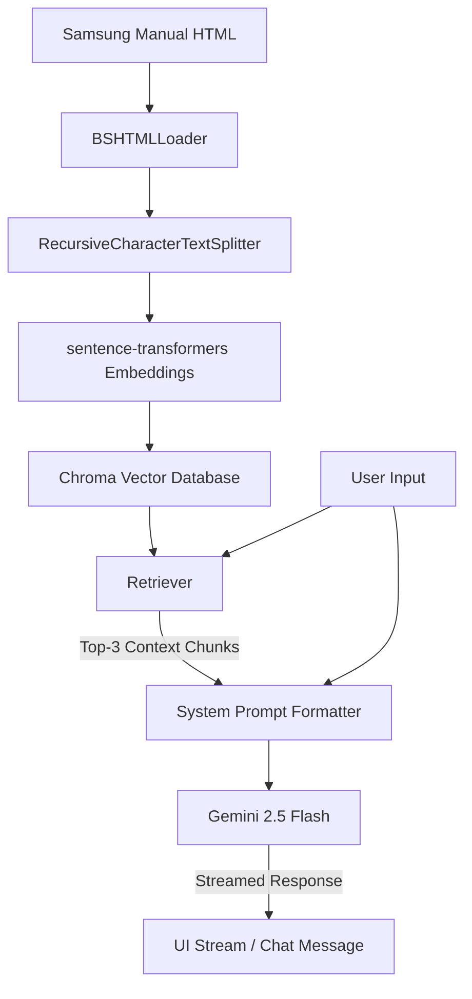

# 🫧 Samsung Wash Assistant — RAG Chatbot

[](https://ragchatbotsforwashingmachine-a2fudq7fsd2uhrn6yfebwz.streamlit.app/)
[](https://www.python.org/)
[](https://github.com/langchain-ai/langchain)
[](https://deepmind.google/technologies/gemini/)

An AI-powered RAG (Retrieval-Augmented Generation) chatbot designed to act as an expert assistant for Samsung washing machines. The chatbot answers user queries by retrieving context from the official product manual, keeping answers precise and secure.

🔗 **Live Application URL**: [https://ragchatbotsforwashingmachine-a2fudq7fsd2uhrn6yfebwz.streamlit.app/](https://ragchatbotsforwashingmachine-a2fudq7fsd2uhrn6yfebwz.streamlit.app/)

---

## ✨ Features

- **🔒 Zero-Leak Security**: Completely decoupled API key management via Streamlit Secrets (no hardcoded credentials in the repository).
- **💡 Smart Welcome Interface**: Beautiful welcome cards with direct-click shortcuts for standard washing cycle questions.
- **🌿 Expert RAG Pipeline**: Uses a localized vector store populated from the official Samsung LEVANT washing machine manual.
- **⚡ Real-Time Streaming**: Interactive message interface with token-by-token streaming responses for a premium chat experience.
- **🎨 Dark Glassmorphism UI**: Custom HSL color palettes, pulsing status indicators, and smooth animations that override default Streamlit themes.

---

## 🏗️ Technical Architecture



- **Document Loader**: LangChain `BSHTMLLoader` parses the HTML manual.
- **Text Splitter**: `RecursiveCharacterTextSplitter` (Chunk size: 500 characters, overlap: 100).
- **Embeddings**: `sentence-transformers/all-MiniLM-L6-v2` runs locally to generate dense representations.
- **Vector DB**: `Chroma` database (in-memory index, cached for instant retrieval).
- **LLM**: `gemini-2.5-flash` for high-speed, accurate reasoning.

---

## 🚀 Local Installation & Run

Follow these steps to run the application locally on your machine.

### 1. Clone the Repository
```bash
git clone https://github.com/mrgraciz123/RAG_Chatbots_For_Washing_Machine.git
cd RAG_Chatbots_For_Washing_Machine
```

### 2. Install Dependencies
Make sure you have Python 3.10+ installed:
```bash
pip install -r requirements.txt
```

### 3. Configure local Secrets
Streamlit will read local secrets from `.streamlit/secrets.toml`. Create this file inside the `.streamlit` directory:
```bash
mkdir .streamlit
notepad .streamlit/secrets.toml
```

Add your Google Gemini API key inside `.streamlit/secrets.toml`:
```toml
GOOGLE_API_KEY = "your_actual_gemini_api_key"
```
*(Note: `.streamlit/secrets.toml` is configured in `.gitignore` to ensure it is never pushed to public repositories).*

### 4. Run the Streamlit Application
```bash
python -m streamlit run app.py
```
Open **[http://localhost:8501](http://localhost:8501)** in your browser.

---

## ⚙️ Configuration Files

- [.streamlit/config.toml](file:///.streamlit/config.toml) - Custom theme configurations (fonts, background gradients, styling tokens).
- [requirements.txt](file:///requirements.txt) - List of dependencies required to set up the environment.
- [.gitignore](file:///.gitignore) - Excludes sensitive local credential files, vector database stores, and development files.
